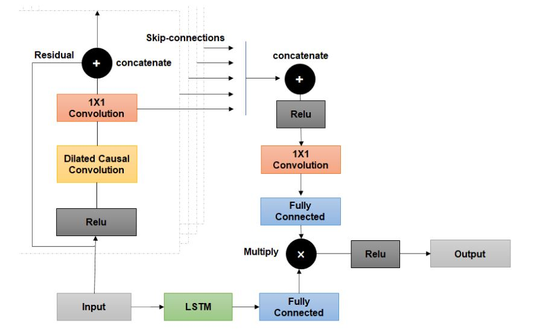
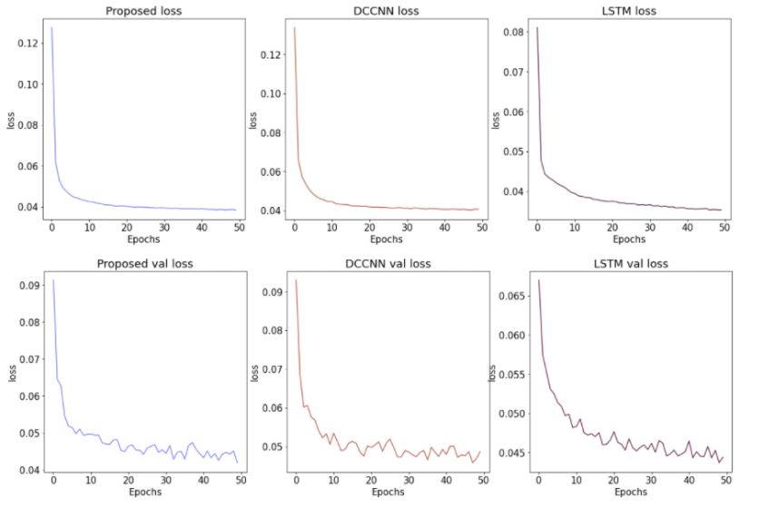
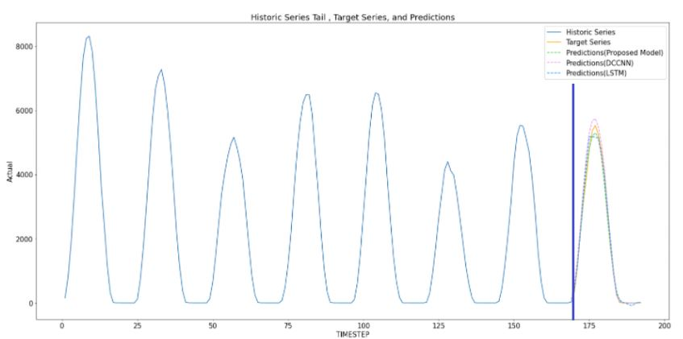

# Prediction-of-Solar-Power-Energy-Generation

DataSet
---------
<p>Dataset(Solar energy power generation and weather data) from the UK region of the Open Power System Data Project </p>
*Download : https://data.open-power-system-data.org/time_series/

Installation
---------
Clone the repository
```
git clone https://github.com/juhjoo/Prediction-of-Solar-Power-Energy-Generation.git
```
```
pip install -r requirements.txt
```
```
python main.py > output.txt 2> error.txt
```

Dependencies
---------
* Python 3.8
* Pandas 
* Tensorflow 2.6
* Keras
* Matplotlib
* Seaborn
* Numpy
* tf-nightly
* Scipy = 1.4.1

Model
---------
* Proposed Model(DCCNN+LSTM)
* DCCNN(Dilated Causal Convolutional Nueral Network)
* LSTM

Model Architecture
--------
<p float="left">
  
</p>

Results
-------
<p float="left">
  
    </p>
    <p float="left">
  
</p>


| Model  | Best Score(WAPE)  |
| --------- | -------|
|DCCNN+LSTM	|0.268|
|DCCNN|	0.278|
|LSTM|	0.278|


## Data

```
data
  ├── time_series_60min_singleindex.csv – CSV file of solar generation time series data
  └── weather_data.csv – CSV file of weather time series data
result
  ├── result_dclstm.csv – CSV file of proposed model results
  ├── result_dccnn.csv – CSV file of DCCNN model results
  └── result_lstm.csv – CSV file of LSTM model results
model Model result files of proposed, DCCNN and LSTM models
  ├── DC_CN_LSTM_Model39.h5  – Model result files of proposed models
  ├── DCCNN_Model14.h5 – Model result files of DCCNN models
  └── LSTM_Model1.h5 – Model result files of LSTM models
src
  ├── data_generation.py – Read and preprocess data set for training and testing 
  ├── experience.py – Functions to predict a result using models and save its as CSV
  ├── metric.py – Function to calculate metrics (WAPE, MAE, and etc.)
  ├── model.py - Functions to make models (proposed, DCCNN, LSTM)
  └──visualization.py – Create graph for the timeseries data and results
main.py – Use functions in experience.py, process.
Requirement.txt : install a library for experience setting
main_experience.ipynb – Make a model and save results as CSV file
main_result.ipynb – Create graph for the result using results
main_visualization.igynb – Create graph for analyzing time series datasets 

```

